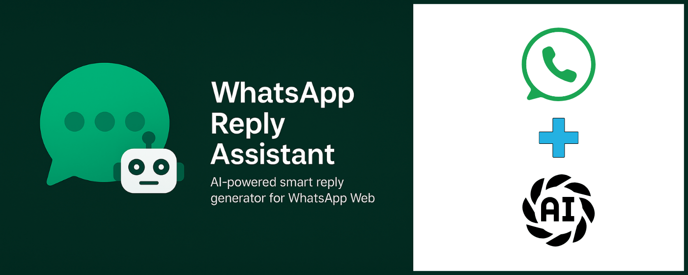

# 🧠 ChatGPT API Smart Replies for WhatsApp – Chrome Extension
[](#) 
[](LICENSE)
[](#)
[](#)

**AI-powered smart reply assistant for WhatsApp Web**, built using **OpenAI's ChatGPT (GPT-4.1-mini)**.  
It suggests 3 smart, friendly replies instantly — in multiple Indian and international languages — using your OpenAI API key.


> 📦 Version: `v1.0.0`  
> 👤 Author: [Md Taufique Khan](https://about.me/mdtaufiquekhan)  
> 🏢 Sponsored by: [Lookmyweb Consultancy Services](https://lookmyweb.com)  
> 📧 Contact: [agreencoder@gmail.com](mailto:agreencoder@gmail.com)  
> 🔗 [Project Web Page](https://mdtaufiquekhan.github.io/chatgpt-api-smart-replies-for-whatsapp/)  
> 🧩 [Chrome Extension](https://chromewebstore.google.com/detail/chatgpt-api-smart-replies/dhgmclmebidjbelkopknjlacdbhagang))
---

<p align="">
  <a href="https://mdtaufiquekhan.github.io/chatgpt-api-smart-replies-for-whatsapp/" target="_blank">
    
  </a>
  <a href="https://chromewebstore.google.com/detail/chatgpt-api-smart-replies/dhgmclmebidjbelkopknjlacdbhagang" target="_blank">
    
  </a>
</p>

---

<details open>
<summary><strong>🧭 Table of Contents</strong></summary>

- **[✨ Features](#-features)**
- **[🌍 Supported Languages](#-supported-languages)**
- **[🚀 How to Use](#-how-to-use)**
- **[☕ Support My Work](#-support-my-work)**
- **[🤝 Sponsor This Project](#-sponsor-this-project)**
- **[🗒️ Planned Features / To-Do](#-planned-features--to-do)**
- **[📁 Project Structure](#-project-structure)**
- **[📦 Version History](#-version-history)**

</details>

---

## ✨ Features

### 🤖 AI-Powered Replies
- Generates 3 GPT-4.1-mini replies
- Auto-inserts with one click

### 🌐 Language Support
- 20+ Indian & international languages
- Script transliteration & force-language mode

### 🔧 UI & Settings
- Draggable reply assistant UI
- Emoji toggle, personalized name replies
- OpenAI API key validation & storage

---

## 🌍 Supported Languages

### 🇮🇳 Indian Languages

| বাংলা (Bengali) | हिन्दी (Hindi) | தமிழ் (Tamil) | తెలుగు (Telugu) | ಕನ್ನಡ (Kannada) |
|-----------------|----------------|----------------|------------------|------------------|
| ગુજરાતી (Gujarati) | मराठी (Marathi) | ਪੰਜਾਬੀ (Punjabi) | മലയാളം (Malayalam) | ଓଡ଼ିଆ (Odia) |

### 🌍 International Languages

| English | Español (Spanish) | Deutsch (German) | Français (French) | Português (Portuguese) |
|---------|-------------------|------------------|--------------------|-------------------------|
| Italiano (Italian) | العربية (Arabic) | Русский (Russian) | 中文 (Chinese) | 日本語 (Japanese) |
| 한국어 (Korean) | Türkçe (Turkish) | Nederlands (Dutch) |  |  |


---

## 🚀 How to Use

### 1. Install the Extension

> 🔧 Developer-only – 

- Clone or download this repo
- Visit `chrome://extensions/`
- Enable **Developer Mode**
- Click **Load unpacked** and select the extension folder

### 2. Set Your OpenAI API Key

- Click the extension icon in the Chrome toolbar
- Enter your OpenAI API key (`sk-...`)
- The key is securely saved and validated via OpenAI

👉 Need a key?  
- [Create an OpenAI Account](https://auth.openai.com/create-account)  
- [View API Documentation](https://openai.com/api/)

### 3. Use on WhatsApp Web

- Go to [https://web.whatsapp.com](https://web.whatsapp.com)
- The assistant UI will auto-appear when a chat is open

### 4. Get Smart Replies Instantly

- When a message is received:
  - The assistant fetches 3 AI-generated replies
  - Click any reply to insert it directly into the message box

### 5. Customize

- 🌐 Choose your reply language
- 😊 Toggle emoji usage
- 📌 Force replies in selected language/script
- 🧲 Drag the floating UI to reposition

---

## ☕ Support My Work

If you found this helpful, please consider supporting:

[](https://buymeacoffee.com/mdtaufiquekhan)

📱 **Scan QR to Support:**


---

## 🤝 Sponsor This Project

This project is open to sponsorship and collaboration.  
If you're a company, community, or individual interested in supporting development, reach out directly:

📧 [agreencoder@gmail.com](mailto:agreencoder@gmail.com)

Or support the project through GitHub Sponsors:

[](https://github.com/sponsors/mdtaufiquekhan/)

---

## 🗒️ Planned Features / To-Do

- 🚀 Auto-send toggle  
- 🧠 GPT model selector (e.g. gpt-3.5, gpt-4-mini)  
- ⚙️ Dedicated extension settings page  
- ⛔ Disable floating assistant  
- 📊 Token usage tracker  
- 🔒 Token cap limit  
- 📏 Chat depth control (higher depth = more context, more token usage)  

---

## 📁 Project Structure

```
whatsapp-reply-assistant/
├── manifest.json
├── background.js
├── content/
│ └── content.js
├── popup/
│ ├── popup.html
│ └── popup.js
├── main-reply-box/
│ ├── floating-ui.html
│ └── floating-ui.css
├── assets/
│ └── images/
│ └── bmc_qr.png
├── LICENSE
└── README.md
```

---

## 📦 Version History

### v1.0.0 – May 2025
- Initial public release
- GPT-4.1-mini based smart reply generation
- Multi-language and transliteration support
- Emoji toggle and forced language mode
- Secure local API key handling and validation
- Floating, draggable assistant UI for WhatsApp Web
